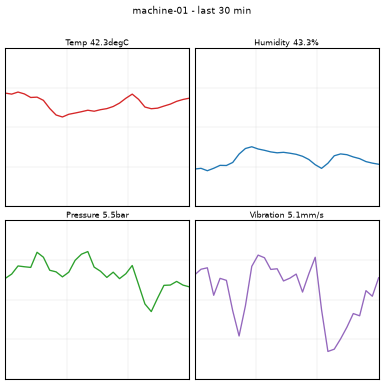

# Fine-tune a VLM that Azure does not offer you

Azure AI gives you a catalog. This repository is about the model that is **not in it**.

It takes `SmolVLM-256M-Instruct` - a vision-language model absent from the Azure AI model
catalog - fine-tunes it with LoRA on Azure Machine Learning, and ends with a **10 MB artifact
that runs anywhere**, including on your laptop with Azure disconnected.

The task is deliberately small and visual: read four sensor charts covering 30 minutes of a
machine, emit a JSON maintenance work order.

| input | output |
|---|---|
|  | `{"device_id": "M-02", "severity": "critical", "root_cause": "bearing_wear", "action_code": "CHK_BEARING", "eta_minutes": 30}` |

## The six bricks

The notebook runs these in order, and demonstrates nothing else:

| # | Brick | What you see |
|---|---|---|
| 1 | A model absent from the catalog becomes a governed AML asset | pinned to a commit SHA, license in the tags |
| 2 | A versioned dataset, built from time-series telemetry | 620 charts + JSONL, chronological split |
| 3 | A LoRA pipeline on spot GPU | `train_lora` (T4 low-priority) -> `merge_lora` (CPU) |
| 4 | **Two** artifacts from one run | adapter **9.8 MB** next to merged **517.9 MB** |
| 5 | An AML endpoint that serves it | chart in, work order out |
| 6 | The adapter detached | same answer, local CPU, no Azure |

**Explicitly out of scope:** fine-tuning quality, scalability, endpoint robustness, monitoring,
blue/green, autoscaling. Success means *"the chain runs end to end and every link is visible"*,
not *"the model is good"*.

## Prerequisites

One hard requirement: **an Azure subscription you can create resources in**. The resource group,
the workspace, both compute clusters, the dataset, the environments and the endpoint are created by
the notebook if they do not exist - name them in `.env` and run the cells.

| | |
|---|---|
| **Azure subscription** | with permission to create resources. An existing AML workspace is **optional**: name one in `.env` and it is reused, name one that does not exist and it is created |
| **GPU quota** | 4 vCPU of `Standard_NC4as_T4_v3`, **low-priority** tier. The compute cell prints your actual quota, so you find out there rather than 30 minutes into a job |
| **Permissions** | Contributor on the subscription or resource group. Plus `Owner` or `User Access Administrator` on the workspace storage account *if* the workspace uses identity-based datastore access (see [Troubleshooting](#troubleshooting)) |
| **Azure CLI** | [installed](https://learn.microsoft.com/cli/azure/install-azure-cli), with the ML extension: `az extension add -n ml` |
| **Python** | 3.10 - 3.12. **Not 3.13/3.14**: `torch` and `peft` have no wheels for them yet |
| **Disk** | ~2 GB for the downloaded base model and artifacts |

> **About the GPU quota.** Dedicated GPU quota is commonly **0** on modern families, and that is
> not a blocker here: low-priority is a *separate quota pool*. If you have 0 dedicated NC-series
> cores, you can still very likely run this. The compute cell prints both rows; you can also check
> with `az ml compute list-usage -g <rg> -w <ws> -o table` and look at the low-priority line.
> Quota is the one thing the notebook cannot provision for you - request an increase from
> *Studio > Quota* if the low-priority row reads 0.

## Quickstart

Run these in a **PowerShell** terminal (see the note below if you are in `cmd`):

```powershell
git clone <this-repo> && cd vlm-lora-azureml

py -0p                                # check what you have; you need 3.10 - 3.12
py -3.12 -m venv .venv                # NOT `python -m venv`: your default may be 3.13/3.14
.\.venv\Scripts\Activate.ps1          # Linux/macOS: python3.12 -m venv .venv && source .venv/bin/activate
python -m pip install -r requirements.txt
python -m pip install -r requirements-local.txt   # brick 6, local inference

Copy-Item .env.example .env           # Linux/macOS: cp .env.example .env
notepad .env                          # fill it in

az login --tenant <your-tenant-id>
```

> **`Activate.ps1` opened in your editor instead of running?** You are in a `cmd` terminal, not
> PowerShell: `cmd` does not execute `.ps1`, it hands the file to its default association. Either
> switch the terminal to PowerShell, or use the cmd activator - `.venv\Scripts\activate.bat`.
> If PowerShell instead answers *"running scripts is disabled on this system"*, unblock the current
> session only: `Set-ExecutionPolicy -Scope Process -Bypass`.

**That is the whole setup.** No other file needs editing. From here, pick one of the
[two ways to run it](#two-ways-to-run-it).

### The one file you fill in

`.env`, at the repo root:

```ini
AZURE_SUBSCRIPTION_ID=00000000-0000-0000-0000-000000000000
AZURE_RESOURCE_GROUP=my-resource-group
AZUREML_WORKSPACE_NAME=my-aml-workspace
AZURE_LOCATION=westeurope
```

- **Already have a workspace?** Put its three identifiers here (Studio > *View all properties*) and
  `AZURE_LOCATION` is ignored.
- **Starting from nothing?** Invent the resource group and workspace names, set `AZURE_LOCATION`,
  and the first cell creates both (~3 min). Set `CREATE_IF_MISSING = False` in that cell if you
  would rather it failed than provisioned.
- **On a locked-down tenant?** The same cell also fixes the two things policy routinely breaks:
  it forces the workspace onto identity-based datastore auth (shared keys are often disabled), and
  if the workspace storage comes out with public network access disabled it opens it back up -
  firewall closed to your egress IP first, public access second, then the allow-list **dropped**
  once public access is on, because AML compute nodes are not on your IP and an allow-list that
  keeps you in keeps every job out. If an Azure Policy `modify` effect silently undoes the middle
  step - the usual case, and it returns 200 while changing nothing - the cell detects it by
  re-reading the account, waives that one rule on **your resource group only** with a policy
  exemption, and retries. `OPEN_STORAGE_TO_MY_IP = False` turns the whole thing off - use it when
  you run from inside the VNet. Details in [Troubleshooting](#troubleshooting).

`.env` is gitignored. It never travels with the code.

## Two ways to run it

Same six bricks, same cells, same Azure resources. The difference is who presses the buttons.

### A. Run it yourself

Open [finetune/notebooks/demo_finetune.ipynb](finetune/notebooks/demo_finetune.ipynb), select the
`.venv` kernel, and run the cells from top to bottom. Stop before the endpoint cell if you only
want the training half; run the teardown cell when you are done.

If you prefer a terminal to a notebook, `scripts/` holds `az ml` equivalents for the parts where a
CLI is genuinely more convenient - creating the GPU cluster, and diagnosing a failed job:

```powershell
.\scripts\60_gpu_cluster.ps1            # create the low-priority T4 cluster
.\scripts\60_gpu_cluster.ps1 -Stop      # panic button: scale it back to 0
python .\scripts\66_job_diag.py         # logs + error tree of the latest pipeline job
python .\scripts\66_job_diag.py --job <job-name>
```

They read the same `.env`. They are a convenience, not a second path: the notebook remains the
canonical run.

### B. Ask an agent to run it

The repository ships the agent definition it was built with:
[.github/agents/run-demo.agent.md](.github/agents/run-demo.agent.md). It carries the run order, the
cost checkpoints and every trap listed under [Troubleshooting](#troubleshooting), so the agent
recognises a 20-second identity failure or a `bf16` mistake instead of theorising about it.

In **VS Code with GitHub Copilot**, open the repo, pick *Run the VLM LoRA demo* in the agent picker
of the Chat view, and say what you want:

```
run the whole demo, but keep it short - MAX_SAMPLES=40
brick 3 failed, what happened?
what is still running and what is it costing me?
shut everything down
```

For **Claude Code** or another agent that reads repository instructions, point it at that same file;
`CLAUDE.md` at the root covers the maintainer-side rules for changing the repo rather than running it.

The agent asks before the two cells that cost money - the GPU pipeline and the endpoint - and offers
the teardown at the end of a session. It does not read or echo your `.env`.

## What the notebook does, cell by cell

| Cells | | Creates | Billable |
|---|---|---|---|
| Setup | connect, creating the resource group and workspace if they are missing | 1 AML workspace (+ its storage, key vault, app insights) | no |
| Setup | create `cpu-cluster` and `gpu-cluster-spot`, print the GPU quota | 2 AmlCompute, both `min_instances=0` | no, at rest |
| Brick 1 | download SmolVLM pinned to its SHA, register it | model asset `base-smolvlm` | no |
| Brick 2 | build 620 charts locally, upload, register | data asset `maintenance_vlm_ds` | no |
| Brick 3 | build 2 environments, submit the pipeline | 2 environments, 1 pipeline job | **GPU, ~15 min** |
| Brick 4 | register and download both outputs | `maint-vlm-adapter`, `maint-vlm-merged` | no |
| Brick 5 | deploy and invoke the endpoint | 1 managed online endpoint on CPU | **continuously** |
| Brick 6 | run the adapter locally, with and without | nothing | no |
| Teardown | delete the endpoint | - | stops the bill |

First full run: roughly an hour, most of it waiting on two Docker image builds (~10 min each)
and the deployment (~10 min). The training itself is ~15 minutes, or ~3 with `MAX_SAMPLES=40`.

## Cost, and the one thing that bills while you sleep

- The **managed online endpoint never scales to zero**. It is the only resource here that bills
  continuously. Create it late, delete it early. A `Standard_DS3_v2` deployment is a few euros
  a day - not a disaster, but not nothing either.
- The **GPU cluster is safe by construction**: `min_instances=0`, idle scale-down at 300 s. It
  allocates a node when a job starts and releases it on its own. Forgetting to stop it is not a
  failure mode.
- **Run the teardown cell when the demo is over.** It is idempotent and self-contained: you can
  run it alone, on a fresh kernel, at 11pm, when you remember you left something on. It deletes
  the *endpoint*, which cascades to the deployment. (Deleting the deployment first is the
  tempting order and the wrong one: a deployment holding traffic refuses to be deleted.)
- To check nothing is allocated on the GPU cluster:
  ```powershell
  az ml compute list-nodes -n gpu-cluster-spot -g $env:AZURE_RESOURCE_GROUP -w $env:AZUREML_WORKSPACE_NAME -o table
  ```

## Layout

```
finetune/
  data/         telemetry_sample.csv   <- 24 h of 4 machines, the committed input
                build_dataset.py, render_charts.py, labeling_rules.py, schema.json
                build_dataset.kql      <- optional: the same windows from ADX/KQL
  models/       fetch_base_model.py, base-model-asset.yml
  environments/ Dockerfile.train, Dockerfile.serve, vlm-lora-env.yml, vlm-serve-env.yml
  components/   train_lora.{py,yml}, merge_lora.{py,yml}
  pipelines/    finetune_pipeline.yml
  endpoints/    endpoint.yml, deployment.yml, score.py
  export/       run_local_adapter.py, eval_visual.py, README-portability.md
  notebooks/    demo_finetune.ipynb    <- the demo, bricks 1-6 in order
scripts/        optional CLI equivalents, see below
.github/agents/ run-demo.agent.md      <- the agent that can run all of it for you
```

Everything the notebook needs is driven from the notebook. The `scripts/` folder is optional:

- `60_gpu_cluster.ps1` - the `az ml` equivalent of the cluster cell, plus a `-Stop` panic button.
- `61_vlm_dataset.ps1` - uploads the dataset to an **ADLS Gen2 filesystem** instead of
  `workspaceblobstore`. Needs `AZURE_STORAGE_ACCOUNT` and a registered datastore pointing at it.
  Skip it unless you already have that setup; the notebook covers the common case.
- `66_job_diag.py` - dumps the logs and error tree of a failed pipeline job.

The 620 chart PNGs are **not committed**. Windowing, labelling and index assignment are fully
deterministic, so the images are a pure function of the CSV: `build_dataset.py` regenerates them
byte-identically in under a minute.

## Troubleshooting

**`pip install` dies with `metadata-generation-failed` on `numpy`, and the wheel names say
`cp314`.** Your virtualenv is on Python 3.14. There are no 3.14 wheels for `numpy`/`torch`/`pillow`
yet, so pip falls back to building from source and fails on the first C extension. The `cp3XX` tag
in the wheel filenames is the tell - check it before you read the compiler error. Rebuild the venv
on a supported interpreter:
```powershell
py -0p                          # list the interpreters you actually have
py -3.12 -m venv .venv          # 3.10 - 3.12 are the supported range
```

**`Access to the path 'python.exe' is denied` when deleting or recreating `.venv`.** VS Code's
Python extensions (black-formatter, isort, Pylance) run *inside* your venv and hold
`.venv\Scripts\python.exe` open - and VS Code restarts them within a second of being killed, so a
kill-then-delete loses the race. Either close VS Code first, or kill and delete in the same loop:
```powershell
foreach ($i in 1..12) {
  Get-CimInstance Win32_Process -Filter "Name='python.exe'" |
    Where-Object { $_.ExecutablePath -like "$PWD\.venv*" } |
    ForEach-Object { Stop-Process -Id $_.ProcessId -Force -ErrorAction SilentlyContinue }
  try { Remove-Item -Recurse -Force .venv -ErrorAction Stop; break } catch { }
}
```
Do not leave a half-rebuilt venv: `python -m venv` rewrites `pyvenv.cfg` even when it fails to
replace `python.exe`, which leaves the config claiming one version and the executable being another.

**`SSLV3_ALERT_HANDSHAKE_FAILURE` reaching `files.pythonhosted.org`, on `torch`'s dependencies.**
First `sympy`, then `networkx`, then the next one - while `transformers`, `peft` and everything in
`requirements.txt` downloaded fine. You are behind a corporate index (the `Looking in indexes:` line
will not say `pypi.org`), and `requirements-local.txt` adds a **second** index for the CPU torch
wheels. With two indexes in play pip resolves torch's shared dependencies to PyPI's CDN rather than
to your mirror - and that is where the TLS interception fails.

Do not chase them one at a time. Install torch's pure-Python dependencies from the mirror in one
go, then resume:

```powershell
python -m pip install --index-url <the first URL on your "Looking in indexes:" line> `
  sympy networkx jinja2 filelock fsspec typing-extensions setuptools
python -m pip install -r requirements-local.txt
```

The second command then finds them all satisfied and only fetches `torch` itself, which comes from
`download.pytorch.org` and not from the failing CDN. Do **not** "fix" this with `--trusted-host`:
that disables certificate verification for the whole install, on a network you have just observed
is intercepting TLS.

**`KeyBasedAuthenticationNotPermitted` - *"Key based authentication is not permitted on this
storage account"* - when the dataset cell uploads.** The traceback points at
`_blob_storage_helper.py` and at a SAS token, which makes it look like a storage bug. It is a
*workspace property*. Two things have to line up, and the notebook now handles both:

1. **The workspace must use identity-based datastore auth.** The SDK default is `accesskey`, so
   `azure-ai-ml` asks the workspace for a key, derives a SAS from it, and the storage account -
   which corporate policy has stripped of shared-key access - refuses it. Nothing fails at
   workspace creation; it surfaces three cells later. Check and fix:
   ```powershell
   az ml workspace show -n <workspace> -g <group> --query systemDatastoresAuthMode
   az ml workspace update -n <workspace> -g <group> --system-datastores-auth-mode identity
   ```
   The setup cell now creates workspaces with `system_datastores_auth_mode="identity"` and
   switches an existing one over if it finds `accesskey`.
2. **You need `Storage Blob Data Contributor` on the workspace storage account - personally.**
   Once datastores are identity-based, the upload travels on *your* token instead of on an account
   key, so the role the cluster identities already hold is not enough. The compute cell now grants
   it to the signed-in user too. Miss this step and step 1 simply converts the error into a bare
   `403` that names no missing role. Role assignments take a minute or two to propagate - a 403 on
   the very next cell usually just means you were faster than Entra ID.

**`AuthorizationFailure` - *"This request is not authorized to perform this operation"* - on any
asset upload.** Note the code carefully: an RBAC problem returns
`AuthorizationPermissionMismatch`. `AuthorizationFailure` is the **network** one, and on a
policy-managed tenant it almost always means the workspace storage account was created with
**public network access disabled**, reachable only through a private endpoint. No amount of role
granting will fix it. Confirm:
```powershell
az storage account show -n <workspace storage> -g <group> `
  --query "{public:publicNetworkAccess, default:networkRuleSet.defaultAction}"
```
**The setup cell repairs this for you.** `OPEN_STORAGE_TO_MY_IP = True` (the default, at the top of
the cell) allow-lists *this machine's egress IP and nothing else*, and prints the one-liner that
reverts it. The order it uses is the entire safety argument, and it is worth understanding before
you do it by hand: these accounts ship with `networkRuleSet.defaultAction: Allow`, so enabling
public access **first** would expose the account to the whole internet until the next command
lands. The cell therefore closes the firewall and adds the IP rule *before* opening public access:

```powershell
az storage account update -n <workspace storage> -g <group> `
  --default-action Deny --bypass AzureServices
az storage account network-rule add --account-name <workspace storage> -g <group> `
  --ip-address <your public IP>
az storage account update -n <workspace storage> -g <group> --public-network-access Enabled
az storage account update -n <workspace storage> -g <group> --default-action Allow
```

The fourth line is not a typo and not a rollback. The allow-list is **scaffolding for the width of
the third command**: keep it, and AML's own compute nodes are locked out, because they are not on
your IP and `bypass: AzureServices` does not cover them - see *"the image build log is empty"*
below. `defaultAction: Allow` exposes the endpoint, not the data; shared-key and anonymous access
are already off, so a token and an RBAC role are still required.

Two things can still stop it, and both print rather than raise:

- **The egress IP cannot be determined.** The cell asks `api.ipify.org`; corporate proxies block
  it routinely. Put the address in `STORAGE_ALLOW_IP` in `.env` and re-run the cell.
- **Azure Policy overrules it.** See the next entry - this is the common case on a corporate
  tenant, and it does not look like a failure.

Firewall rules take up to a minute to propagate, so a 403 on the very next cell can simply mean you
were faster than the storage service.

**The storage repair reports success, and nothing changes.** `az storage account update
--public-network-access Enabled` exits 0, prints nothing, and `publicNetworkAccess` is still
`Disabled`. This is not a bug and not a race: it is an **Azure Policy with a `modify` effect**,
which does not *reject* the write - it rewrites the property inside the request. The PUT returns
200 on a value the service never stored. Name the policy:

```powershell
$id = az storage account show -n <workspace storage> -g <group> --query id -o tsv
az policy state list --resource $id `
  --query "[?policyDefinitionAction=='modify'].policyDefinitionName" -o tsv
```

A typical answer is `StorageAccount_PublicNetwork_Modify`. Then find where it is assigned:

```powershell
az policy state list --resource $id `
  --filter "policyDefinitionName eq 'StorageAccount_PublicNetwork_Modify'" `
  --query "[0].[policyAssignmentName,policyAssignmentScope]" -o tsv
```

The scope is usually a **management group**, often the tenant root -
`/providers/Microsoft.Management/managementGroups/...`. That sounds like the end of the road. It is
not, and the way out is much smaller than it looks: **a policy exemption may be created at any
scope *below* the assignment**, and `Owner` on your own resource group is enough. You do not need
any right on the management group, and the rest of the tenant is untouched.

**The setup cell now does this automatically**, and only when the first attempt is proven to have
silently failed. It waives *one* definition - the public-network one - on *one* resource group,
then retries and re-reads the account. By hand it is:

```powershell
$id = az storage account show -n <workspace storage> -g <group> --query id -o tsv
az policy state list --resource $id `
  --query "[?policyDefinitionAction=='modify'].{a:policyAssignmentId,r:policyDefinitionReferenceId}" -o json

az policy exemption create --name exempt-storage-public-network -g <group> `
  --policy-assignment <the assignment id from above> `
  --policy-definition-reference-ids <the reference id from above> `
  --exemption-category Waiver
az storage account update -n <workspace storage> -g <group> --public-network-access Enabled
```

`--policy-definition-reference-ids` matters: the assignment is an *initiative*, and without it you
would waive every rule in it - including the ones disabling shared-key auth and anonymous blob
access, which this demo has no business turning off. Undo it with:

```powershell
az policy exemption delete --name exempt-storage-public-network -g <group>
```

**If the exemption itself is refused**, you lack `Microsoft.Authorization/policyExemptions/write`
even on your own group, and the tenant has genuinely decided this storage is
private-endpoint-only. The only remaining route is to stop uploading from the laptop: turn on the
workspace **managed virtual network** and run this notebook on an **AML compute instance** inside
it. AML then provisions private endpoints from that network to its own storage, so the upload never
touches the public endpoint and the policy has nothing to object to:

```powershell
az ml workspace update -n <workspace> -g <group> --managed-network allow_internet_outbound
az ml compute create -n demo-ci -g <group> -w <workspace> `
  --type ComputeInstance --size Standard_DS3_v2
```

Then open the repo in the compute instance's JupyterLab, set `OPEN_STORAGE_TO_MY_IP = False` (there
is nothing to repair from in there) and run the notebook normally. Provisioning the managed network
takes a few minutes on the first compute that uses it.

**The pipeline fails immediately and the only log is a three-line `20_image_build_log.txt`.** The
child step has no `user_logs/` at all, `status_details` is `null`, and the image build run it points
at has no logs of its own either - a dead end in every direction. **The cause is the storage
firewall**, and nothing in the error says so. Once `networkRuleSet.defaultAction` is `Deny`, AML
stops building environment images with ACR Tasks - the build agent has no route to the build
context - and switches to *image build on compute*. If no compute is nominated for that, the build
fails before a single layer is pulled. Confirm there was never an ACR task run:

```powershell
az acr task list-runs -r <workspace acr> --top 5 -o table   # empty
```

Nominating a compute is only half the story, and the half that misleads:

```powershell
az ml workspace update -n <workspace> -g <group> --image-build-compute cpu-cluster
```

**The pipeline still fails, now after ~8 minutes, and the image build log is empty.** The build run
is a real command job on `cpu-cluster` this time - `az ml job show -n imgbldrun_xxxxxxx` shows
`StartTimeUtc`/`EndTimeUtc` eight minutes apart - but its artifact folder contains exactly one file,
`run_aggregate_log.txt`, holding nothing but its own run ID and a Studio link. No driver log, no
`user_logs/`, nothing in the blob store:

```powershell
az storage blob list --account-name <storage> --container-name azureml `
  --prefix "ExperimentRun/dcid.imgbldrun_xxxxxxx" --auth-mode login --query "[].name" -o tsv
```

**An empty log is itself the evidence.** A job that fails for a code reason writes a log; a job that
cannot *write* a log cannot reach the storage account. And it cannot, because the allow-list added
to repair *your* access contains **your** egress IP and nothing else. **AML compute nodes are not in
your VNet and are not covered by `bypass: AzureServices`** - that bypass exists for control-plane
services, not for the VMs that run your jobs. So the node can neither read the build context nor
upload a byte of diagnostics, and dies silently at the setup timeout.

The fix is to drop the allow-list, keeping public access on:

```powershell
az storage account update -n <storage> -g <group> --default-action Allow
az storage account show   -n <storage> -g <group> --query networkRuleSet.defaultAction -o tsv
```

This is how these accounts ship, and it exposes the *endpoint*, not the data: shared-key auth and
anonymous blob access are already disabled by policy, so every request still needs an Entra token
and an RBAC role. **The setup cell now does this for you** as the third step of the repair, and
re-runs it on any account it finds with `defaultAction: Deny`.

With the storage reachable, ACR Tasks works again and `image_build_compute` is no longer needed -
the compute cell only sets it while it sees the firewall on. Note that AML **ignores an empty
string** when you try to clear it (`--image-build-compute ""` returns 0 and changes nothing); if it
is already set, leave it. Builds on compute are slower and spin up a node, but they work.

**`Identity of the specified managed compute ... is not found`, job dies in ~20 s.**
The workspace uses identity-based datastore auth and the cluster's managed identity has no
data-plane role. The cluster cell attempts the role assignment for you; if it printed a warning,
someone with `Owner` / `User Access Administrator` must run:
```powershell
az role assignment create --assignee-object-id <cluster principal id> --assignee-principal-type ServicePrincipal `
  --role "Storage Blob Data Contributor" --scope <workspace storage account resource id>
```

**`InvalidAuthenticationTokenTenant`, or a `ResourceGroupNotFound` on a group that plainly
exists.** Your `az` session drifted to another tenant. Reflex: `az account show` *before* forming
any other hypothesis, then `az login --tenant <your-tenant-id>`.

**`az is logged into subscription X, but .env says Y`.** The setup cell refuses to create a
workspace when those two disagree - the same drift that makes a real resource group look missing
would otherwise have you provisioning a brand new workspace in the wrong subscription. Run
`az account set --subscription <the one in .env>`.

**`AttributeError: 'dict' object has no attribute 'value'`, or `TypeError: int() argument must
be ... not 'NoneType'`, in the quota report right after both clusters were created.** One bug, two
faces, and **neither is a quota problem**. Some `azure-ai-ml` versions half-deserialise the usage
payload: `usage.name` stays a raw dict instead of becoming a `UsageName`, and `usage.current_value`
stays `None` while the real number sits beside it under its camelCase REST name `currentValue`.
Dumping one row shows both halves at once:
```python
{'current_value': None, 'limit': 200, 'name': {'value': 'TotalClusters', ...}, 'currentValue': 2}
```
The notebook now reads both spellings. If you hit this on an older checkout, **the clusters were
created** - the cell died on the line that reports them, not on the line that makes them - so just
re-run it.

**The low-priority quota row prints 0.** Quota is the one thing the notebook cannot create for
you. Request an increase from *Studio > Quota*, or pick a region that has some and put it in
`AZURE_LOCATION`. Note that the cluster is created successfully either way: the limit is enforced
when a node is **allocated**, not when the cluster is defined.

**The quota report shows the same family twice, and flags one of them.** The dedicated and the
low-priority rows carry an *identical* `name.value`; the only field that tells them apart is
`usage.type` (`.../dedicatedCores/usages` vs `.../lowPriorityCores/usages`). Filtering on the label
alone therefore prints one line twice and raises the alarm on the dedicated row - a quota of 0
there is normal and **not** a blocker, since the pipeline runs low-priority. Also, a limit of `-1`
means *unlimited*, not "minus one core". The cell now splits on `usage.type` and renders both.

**The job fails inside a loss helper with `cannot import name 'Inf' from 'numpy'`.**
Something upgraded numpy past 2.0 in the image. Both Dockerfiles pin `numpy<2` for exactly this:
the curated image's `scipy` still does `from numpy import Inf`, an alias deleted in numpy 2.0.
When you layer pip onto a curated image, pin what the image already depends on.

**A Dockerfile fix appears to do nothing.** AML environments are **immutable**. The YAMLs declare
no version so AML auto-increments, and components reference `@latest` - re-run the environment
cell and check the version number actually changed.

**The deployment is killed before it ever answers.** Loading transformers on CPU exceeds the
default probe delays. The notebook sets `initial_delay=600` on both probes; do not lower it.

**A copied-from-a-tutorial `bf16=True` in `train_lora.py`.** The T4 is Turing (sm75): no bf16, no
flash-attention-2. Use `fp16=True` and `attn_implementation="eager"`. This is the single most
likely cause of a failed job on this hardware.

## Portability

The adapter is 2,442,240 parameters - a *delta*, not a model. See
[finetune/export/README-portability.md](finetune/export/README-portability.md) for running it on
vLLM, GGUF/Ollama, ONNX on an AI PC, or in another AML registry. The contract that makes the
delta meaningful is the `base_model` / `base_repo` / `base_revision` tag set carried by both
artifacts: an adapter without its base is 10 MB of noise.

## License

[MIT](LICENSE) for the code. `SmolVLM-256M-Instruct` is Apache-2.0, downloaded at run time and
not redistributed here. Chosen on purpose because it is **ungated**: a license click cannot be
automated, so a gated repo breaks the chain at brick 1.
